# CUDA Path Tracer

**University of Pennsylvania — CIS 5650: GPU Programming and Architecture, Project 3**

* Andrea Gonzalez Varela
* Tested on: Linux, 13th Gen Intel(R) Core(TM) i9-13980HX @ 5.6GHz 128GB, RTX 2000 Ada Generation 8GB (Personal)

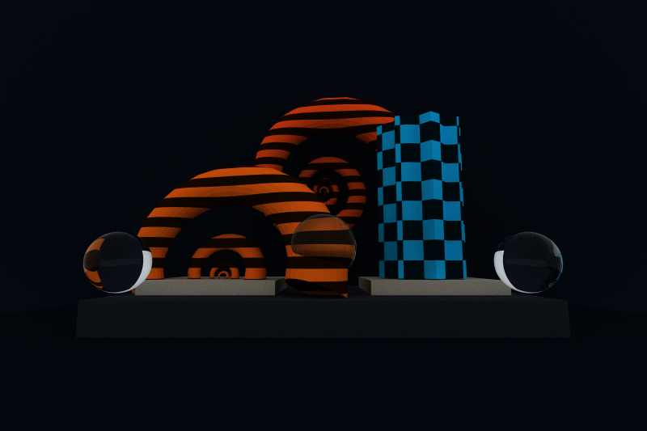

## Overview

This project is an interactive CUDA path tracer. It supports diffuse global illumination, stochastic antialiasing, explicit light sampling with multiple importance sampling, refractive materials, depth of field, arbitrary triangle meshes, image and procedural textures, bump mapping, and a GPU-traversed bounding volume hierarchy.

## Implemented features

### Shading kernel with BSDF

I use a Lambertian BSDF for diffuse surfaces and sample a random direction in the hemisphere for the next ray. Each path keeps track of its color and accumulated light between bounces.

### Rays, path segments, and intersections contiguous in memory

I store path segments and intersections in contiguous arrays on the GPU. After every bounce, I use thrust to remove finished paths and optionally sort the rest by material.

### Stochastic sampled antialiasing

I jitter each camera ray inside its pixel. Averaging the samples over many iterations smooths out jagged edges.

### Arbitrary mesh loading

| obj lamp post                                    | glb chair                                         |
| ------------------------------------------------ | ------------------------------------------------- |
| 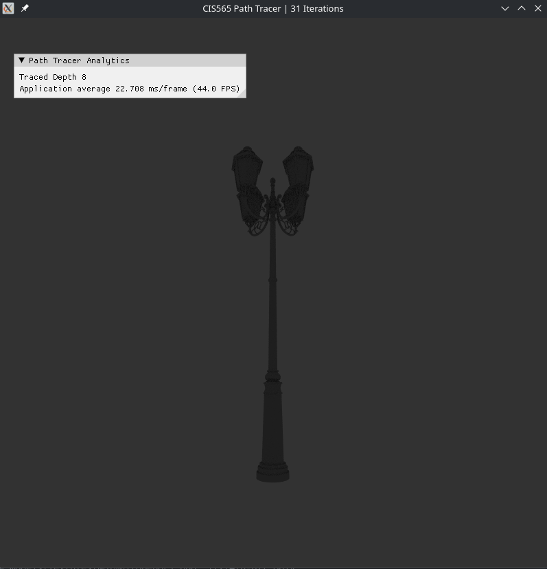 | 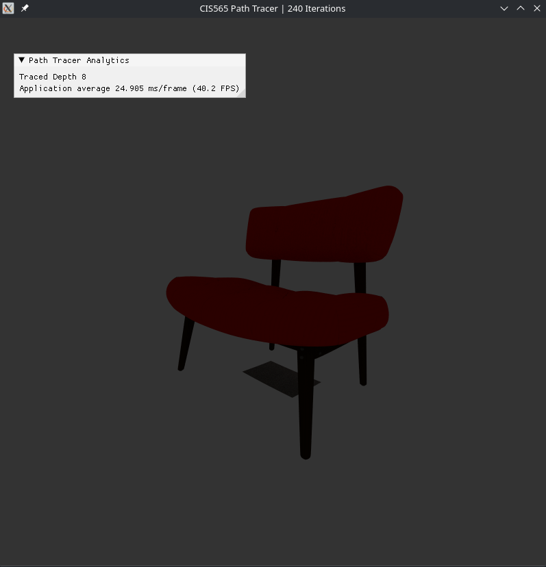  |

I use TinyObjLoader for OBJ files and TinyGLTF for glTF/GLB files. I convert the loaded meshes into triangles and keep their materials, normals, UVs, and textures when available.

### Refraction

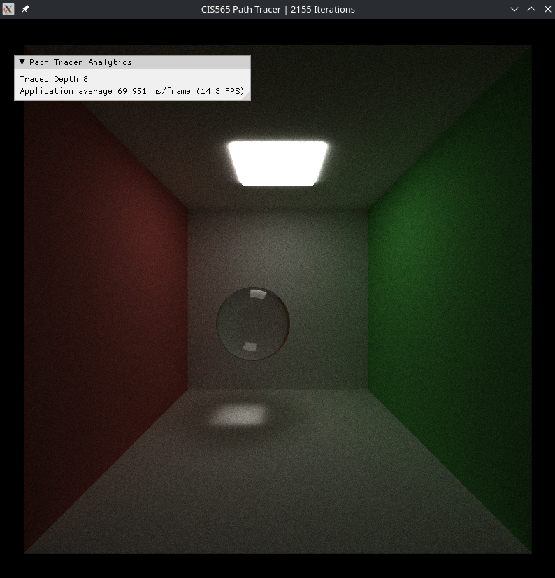

I use Schlick's approximation to randomly choose between reflection and refraction based on the incident angle and index of refraction. I also check for total internal reflection.

### Depth of field

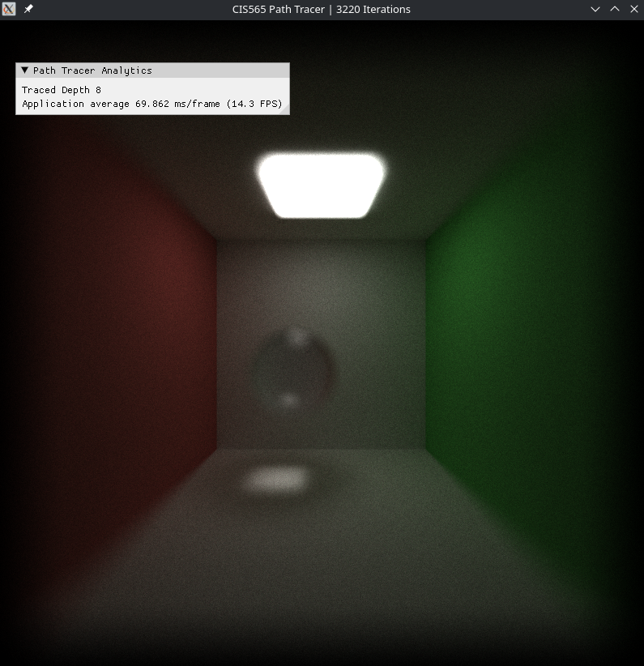

I sample the ray origin on a disk around the camera and point it back toward the focal plane. The lens radius controls the amount of blur and the focal distance controls what stays in focus.

### Texture mapping

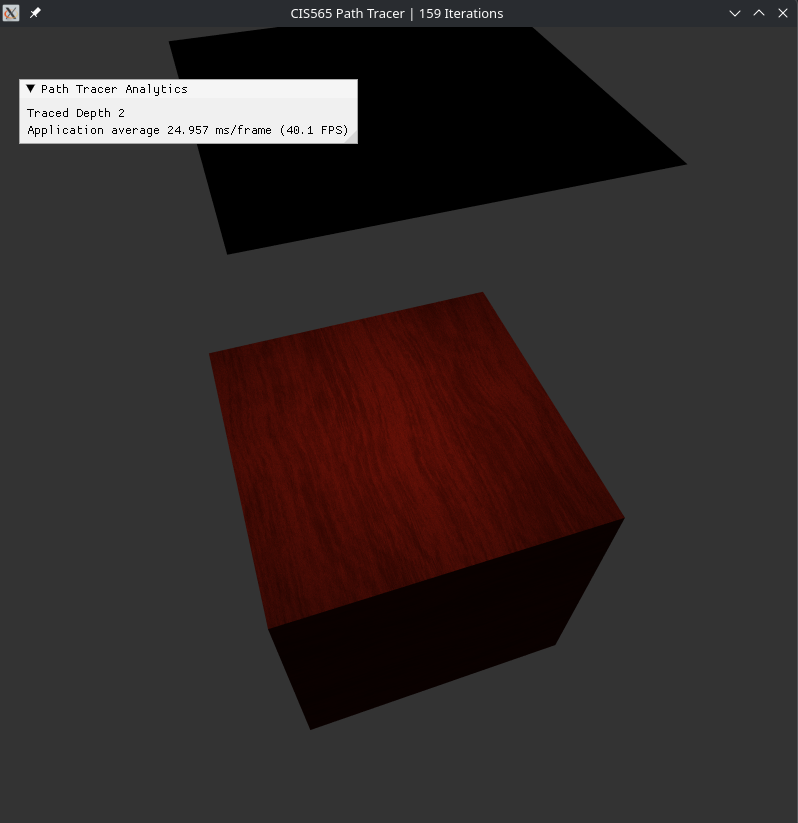

I interpolate triangle UVs with barycentric coordinates and bilinearly sample textures on the GPU. I also added procedural checker and stripe textures, along with bump mapping that changes the surface normal.

### Direct lighting

| Direct lighting without MIS                                    | Direct lighting disabled                                 |
| -------------------------------------------------------------- | -------------------------------------------------------- |
| 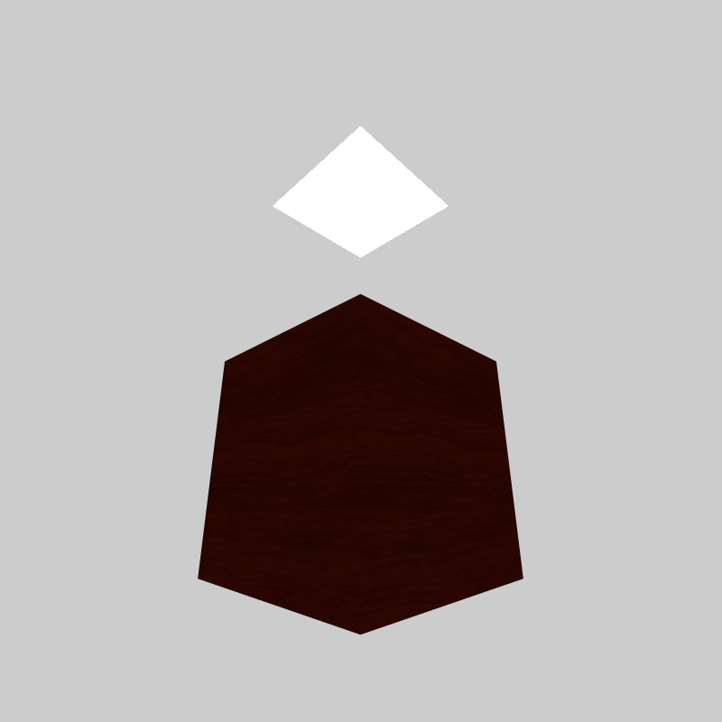 |  |

At each diffuse hit, I sample a point on an emissive triangle and cast a shadow ray toward it. I combine light and BSDF sampling with the power heuristic for MIS.

### Environment light

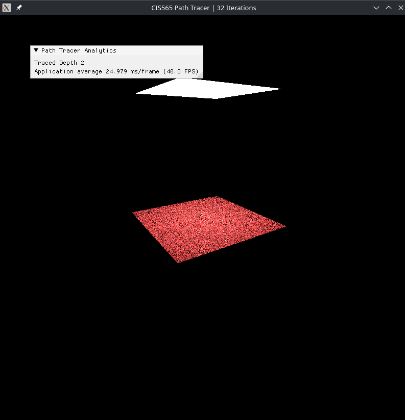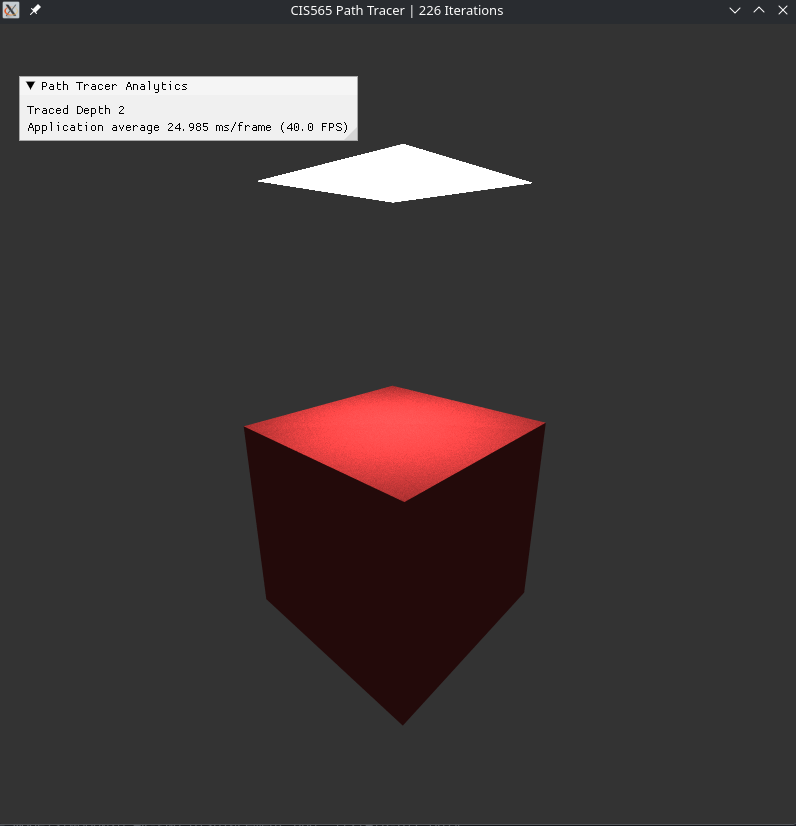

I implemented a toggleable environment light to be able to view scenes without emmissive materials.

### Halton sequences for Monte Carlo sampling

| Random                                           | Halton                                           |
| ------------------------------------------------ | ------------------------------------------------ |
| 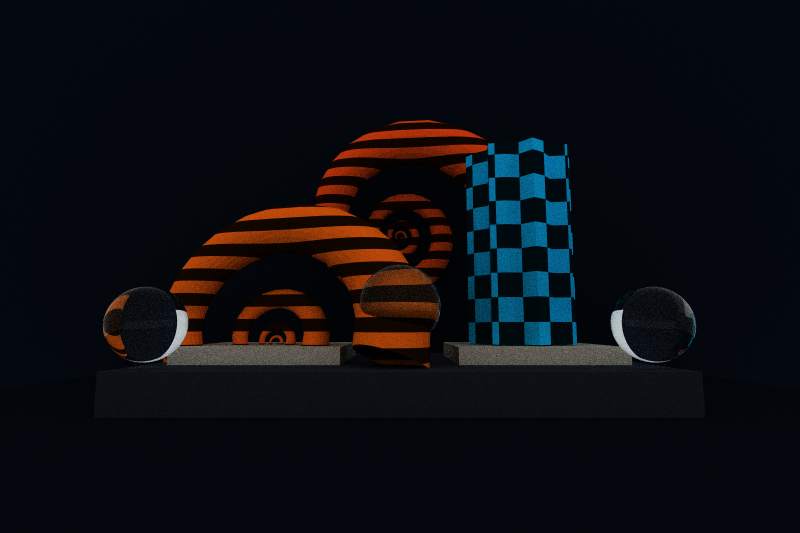 | 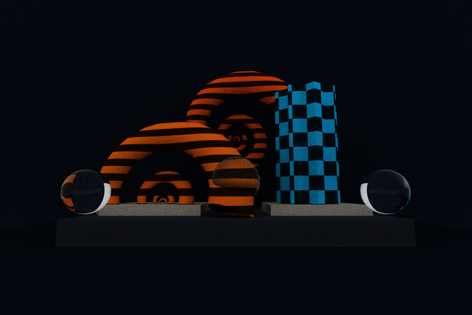 |

I use Halton sequences with different prime bases for pixel jitter, lens sampling, direct lighting, and Russian roulette. This gives me deterministic samples that are spread out more evenly than regular random numbers.

### Russian roulette path termination

After the second bounce, I randomly terminate paths based on their remaining throughput. I reweight paths that survive so the result stays unbiased, then stream compaction removes the terminated paths.

### Bounding volume hierarchy

I build the BVH on the CPU and use the surface area heuristic to decide where to split the geometry. I flatten the finished tree into a contiguous array and copy it to the GPU. Each thread traverses it iteratively with a small local stack instead of using recursion.

These measurements use a release build and include initialization, rendering, readback, and image output.

| Configuration (cornell.json, 400 x 400 px, 1000 spp, depth 8) | Time (s) | Relative to all enabled |
| ------------------------------------------------------------- | -------: | ----------------------: |
| BVH and russian roulette enabled                              |    25.77 |                baseline |
| BVH disabled, linear scan instead                             |    27.70 |             7.5% slower |
| Russian roulette disabled                                     |    27.71 |             7.5% slower |

The Cornell scene is small, so the BVH only improved the total render time by about 7.5%. Russian roulette had a similar result because many rays already escape through the open side before reaching the maximum depth.

The difference is much clearer in the museum scene, which has about 23,040 triangles. At 96 x 64 pixels, 50 spp, and depth 4, the BVH version took 2.277 s compared with 11.609 s using a linear scan. This made it about 5.1× faster.

### Parametric shapes

| Shells                                           | Vases                                            |
| ------------------------------------------------ | ------------------------------------------------ |
| 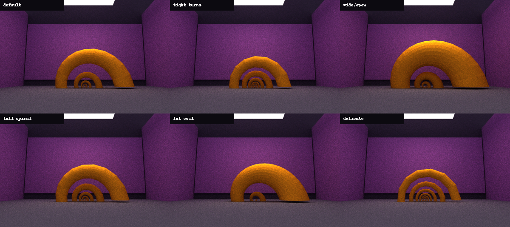 | 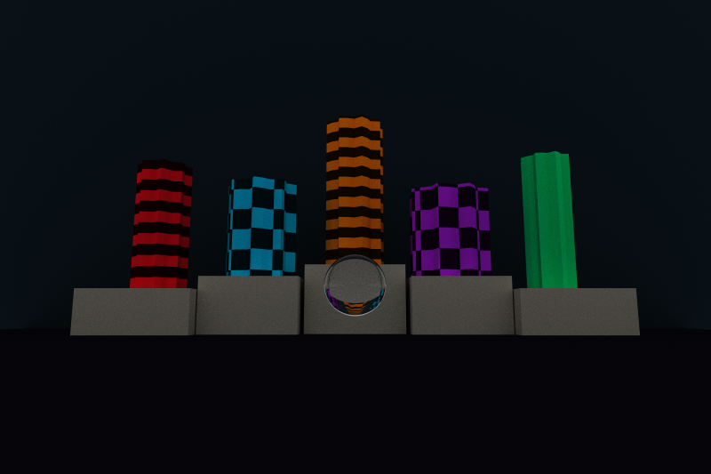 |

I generate both shapes on the CPU when the scene loads. The shell uses an exponential spiral where the center and opening get larger as it coils. The vase is a surface of revolution with sine waves added to its profile. I sample both equations over a 2D grid and connect each group of four points into two triangles. After that, they use the same BVH and shading code as imported meshes.

The shell parameter sweep was produced by temporarily changing the global shell constants in `src/scene.cpp` and restoring the defaults afterward.

### Material sorting

After finding intersections, I sort the active paths by material ID so nearby CUDA threads are more likely to take the same shading branch. This should reduce warp divergence, but it does not seem to offset the cost of sorting. On the showcase scene at 160 x 107 pixels, 150 spp, and depth 6, sorting took 4.714 s compared with 4.740 s without it, which does not seem to be a significant difference

## Building and running

The current CMake configuration targets CUDA architecture 89 for the RTX 2000 Ada GPU.

```bash
cmake -S . -B build -DCMAKE_BUILD_TYPE=Release
cmake --build build -j
./build/bin/cis565_path_tracer scenes/cornell.json
```

OBJ, glTF, and GLB files can be passed directly as arguments:

```bash
./build/bin/cis565_path_tracer models/Wooden_Chair.obj
./build/bin/cis565_path_tracer models/SheenChair.glb
```

On a Linux laptop using NVIDIA PRIME render offload, I need to launch the program using:

```bash
__NV_PRIME_RENDER_OFFLOAD=1 __GLX_VENDOR_LIBRARY_NAME=nvidia \
  ./build/bin/cis565_path_tracer scenes/cornell.json
```

### References

* I used [TinyGLTF](https://github.com/syoyo/tinygltf) to parse .glb, .gltf files and [tinyobjloader](https://github.com/tinyobjloader/tinyobjloader) to parse .obj files.

- I took inspiration/learned how to implement the following features from Physically Based Rendering: [diffuse reflection](https://pbr-book.org/4ed/Reflection_Models/Diffuse_Reflection), [dielectric BSDFs](https://pbr-book.org/4ed/Reflection_Models/Dielectric_BSDF.html), [camera models](https://pbr-book.org/4ed/Cameras_and_Film/Projective_Camera_Models), [textures](https://pbr-book.org/4ed/Textures_and_Materials), [direct lighting](https://pbr-book.org/4ed/Light_Transport_I_Surface_Reflection/A_Better_Path_Tracer), and the [PBRT v3 BVH](https://www.pbr-book.org/3ed-2018/Primitives_and_Intersection_Acceleration/Bounding_Volume_Hierarchies)
- Paul Bourke's [notes](https://paulbourke.net/miscellaneous/raytracing/) for stochastic sampled antialiasing
- I used help from [GPU Gems 3, Chapter 20: GPU-Based Importance Sampling](https://developer.nvidia.com/gpugems/gpugems3/part-iii-rendering/chapter-20-gpu-based-importance-sampling) to implement MIS
- I learned about halton noise from: [UCSD CSE 168 notes on random and low-discrepancy sampling](https://cseweb.ucsd.edu/classes/sp17/cse168-a/CSE168_07_Random.pdf)
- The procedural shell was inspired by the [Raup coiling model](https://doc.ktch.dev/stable/tutorials/coiling/raup_model/)
- e uses a [surface-of-revolution parameterization](https://pages.mtu.edu/~shene/COURSES/cs3621/LAB/surface/rev-surf.html) with sinusoidal radial displacement.
- OBJs:
  - Street lamp: [www.cgtrader.com/free-3d-models/exterior/street-exterior/streetlight-607394f5-b297-47ac-a82d-0498fd54fd28](https://www.cgtrader.com/free-3d-models/exterior/street-exterior/streetlight-607394f5-b297-47ac-a82d-0498fd54fd28)
  - Chair: [github.khronos.org/glTF-Assets/model/SheenChair](https://github.khronos.org/glTF-Assets/model/SheenChair)
  - Wooden chair for texture: [www.cgtrader.com/items/7594707/download-page](https://www.cgtrader.com/items/7594707/download-page)

## Bloopers

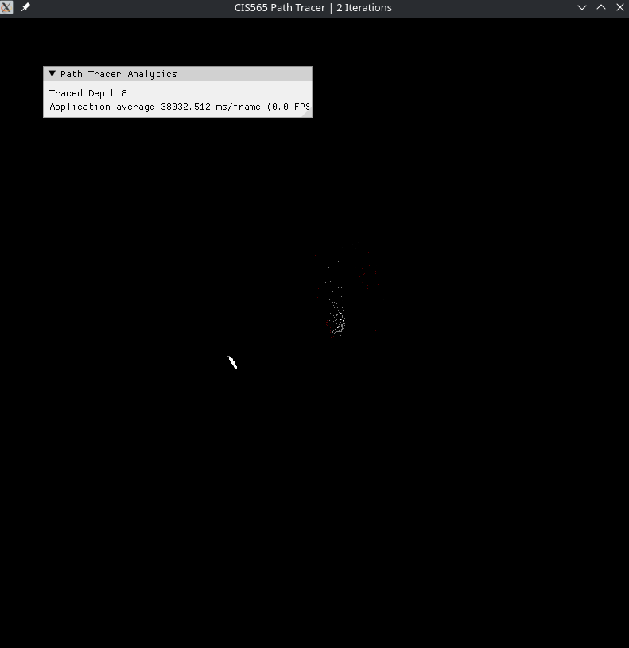

Unsuccesfully trying to render a complex obj before implementing hierarchical spatial data structures

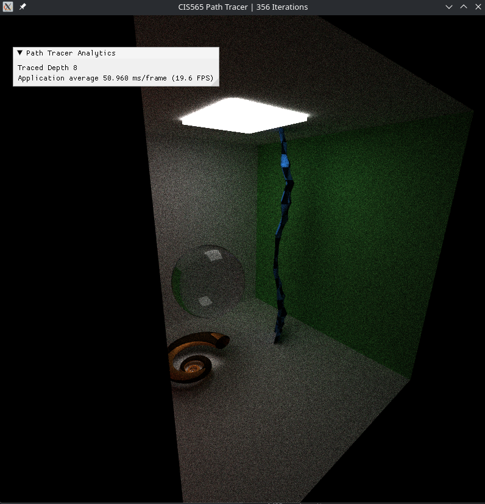

the vase was a snake (i set the height too tall)

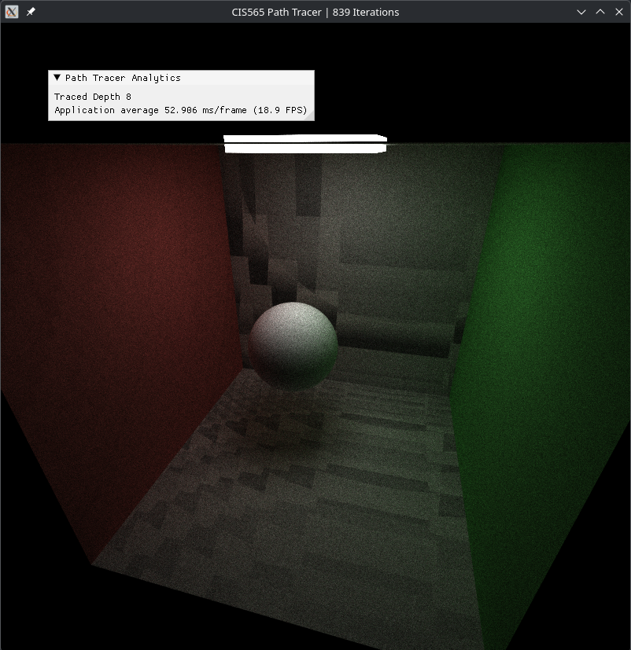

Extra texture :) fixed by offsetting by normals
